# Laboratório Windows Server + Active Directory

Projeto prático de implantação e administração de uma infraestrutura de TI utilizando Windows Server e máquinas virtuais.

O objetivo foi montar um ambiente semelhante ao encontrado em uma pequena empresa, colocando em prática tarefas de suporte técnico, administração de usuários e gerenciamento de infraestrutura.

## Tecnologias utilizadas

* Windows Server
* Active Directory
* DNS
* DHCP
* Group Policy (GPO)
* PowerShell
* SMB
* NTFS
* Microsoft Hyper-V

## Ambiente do laboratório

O laboratório foi montado utilizando máquinas virtuais no **Microsoft Hyper-V**.

A estrutura principal ficou assim:

```text
                    ┌─────────────────────┐
                    │     SERVIDORWIN     │
                    │    Windows Server   │
                    │                     │
                    │ Active Directory    │
                    │ DNS                 │
                    │ DHCP                │
                    │ GPO                 │
                    │ File Server         │
                    └──────────┬──────────┘
                               │
                               │ empresa.local
                               │
                    ┌──────────▼──────────┐
                    │       CLIENTE       │
                    │    Windows Client   │
                    │                     │
                    │ Ingressado no       │
                    │ domínio             │
                    └─────────────────────┘
```

## Active Directory

Foi criado o domínio:

```text
empresa.local
```

O servidor `SERVIDORWIN` atua como controlador de domínio e concentra os principais serviços utilizados no laboratório.

Também foi criada uma estrutura de Unidades Organizacionais (OUs) para organizar usuários, computadores, grupos e servidores.

```text
empresa.local
│
└── Empresa
    │
    ├── Computadores
    ├── Grupos
    ├── Servidores
    └── Usuarios
        │
        ├── Administrativo
        ├── Comercial
        ├── Financeiro
        ├── RH
        ├── Suporte
        └── TI
```

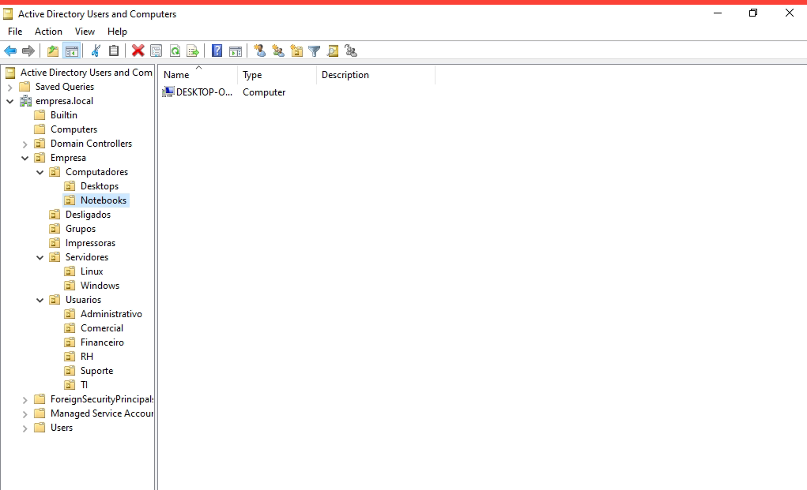

## Usuários e grupos

Foram criados usuários para representar funcionários de diferentes setores da empresa.

Também foram criados grupos de segurança para organizar o acesso aos recursos do ambiente.

A utilização de grupos facilita o gerenciamento de permissões, evitando configurar acessos individualmente para cada usuário.

Exemplo:

```text
GG-TI
│
├── Usuário 1
├── Usuário 2
└── Usuário 3
```

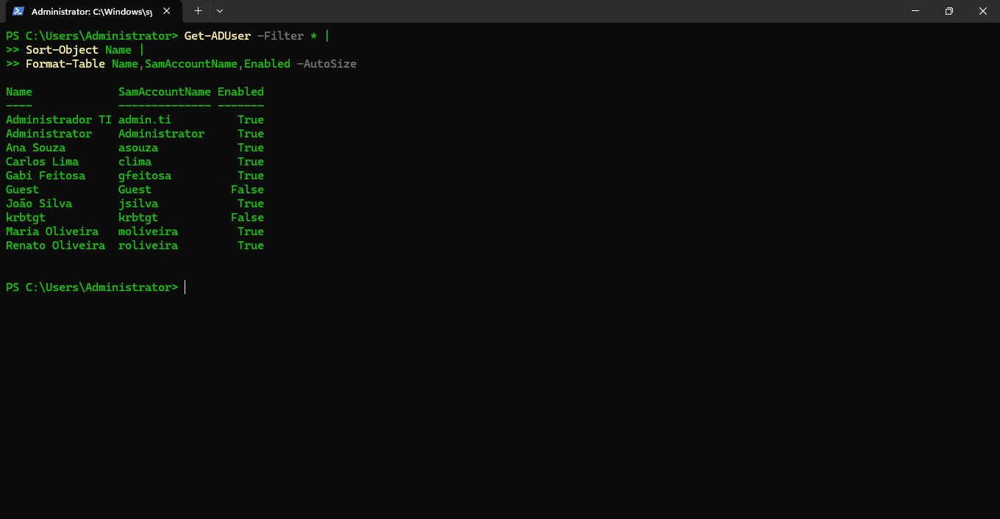

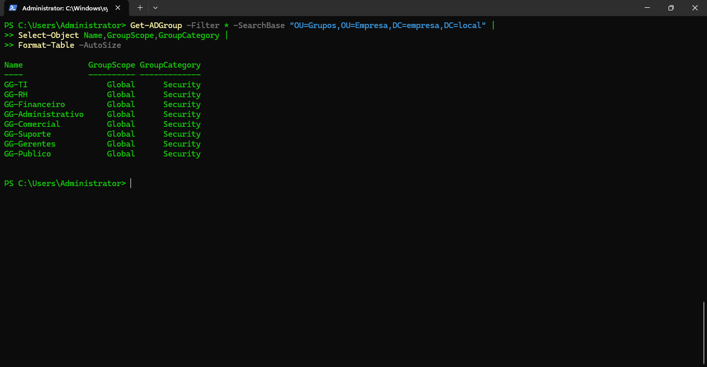

## Computadores

A máquina cliente foi adicionada ao domínio `empresa.local` e passou a fazer parte do ambiente do Active Directory.

Depois do ingresso no domínio, foram realizados testes de:

* Autenticação
* Comunicação com o servidor
* Resolução de nomes
* Aplicação de GPO
* Acesso a recursos compartilhados

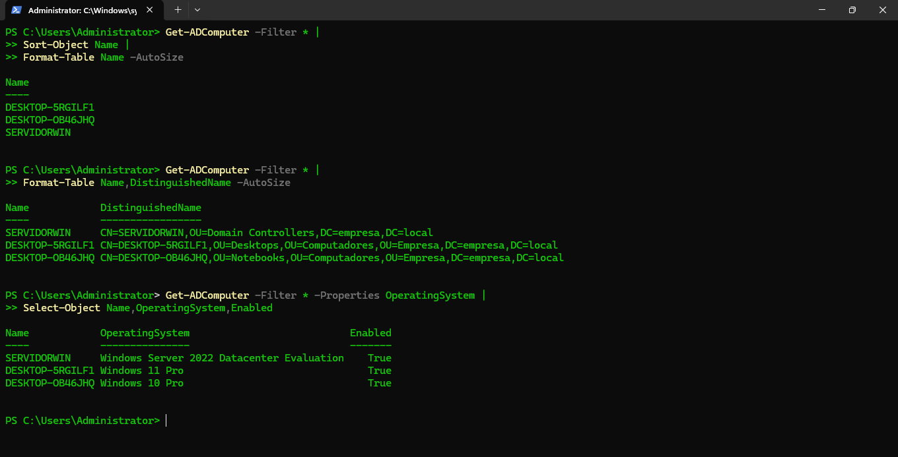

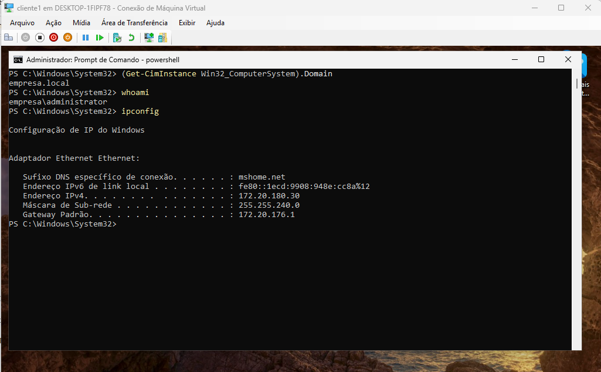

## DNS

O DNS foi configurado no servidor para permitir que os computadores localizassem o domínio e os serviços utilizando nomes.

Foram realizados testes no cliente utilizando:

```cmd
nslookup empresa.local
```

```cmd
nslookup SERVIDORWIN.empresa.local
```

Também foi utilizado PowerShell:

```powershell
Resolve-DnsName empresa.local
```

Esses testes foram utilizados para verificar se o cliente conseguia resolver corretamente os nomes do domínio e do controlador de domínio.

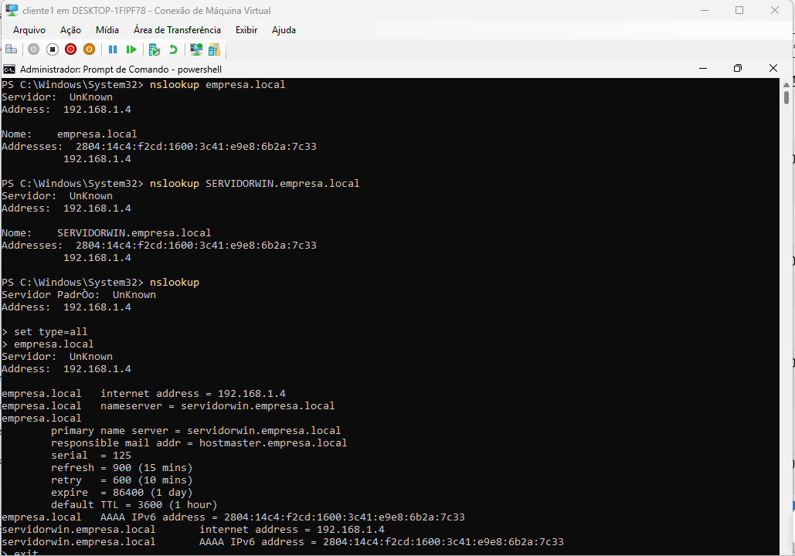

## DHCP

O DHCP foi configurado para fornecer automaticamente as informações de rede para a máquina cliente.

Entre as informações fornecidas estão:

* Endereço IP
* Máscara de rede
* Gateway
* Servidor DNS

A configuração recebida pelo cliente foi verificada com:

```cmd
ipconfig /all
```

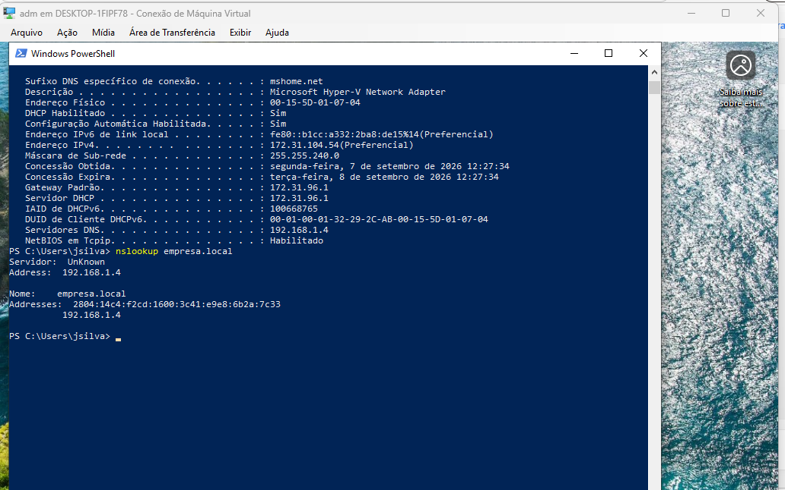

## Group Policy

Foi criada uma política de grupo (GPO) para testar a aplicação de configurações no computador cliente.

Depois da criação da política, foi utilizado:

```cmd
gpupdate /force
```

para atualizar as políticas.

Em seguida:

```cmd
gpresult /r
```

para verificar quais políticas estavam sendo aplicadas ao computador.

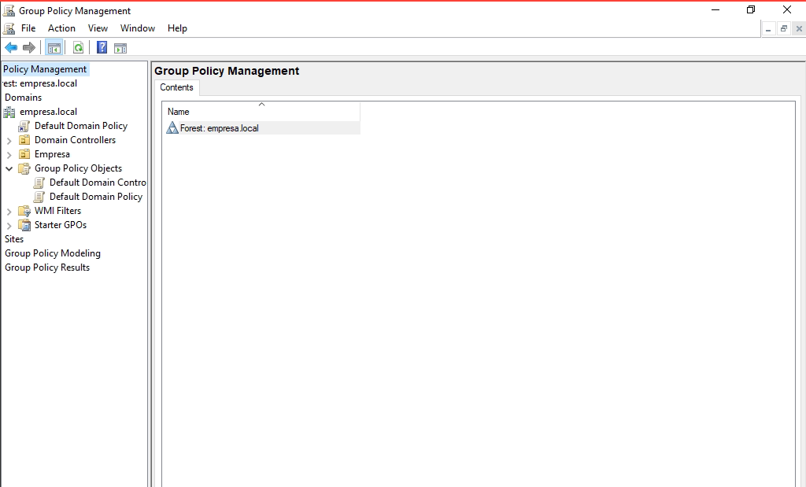

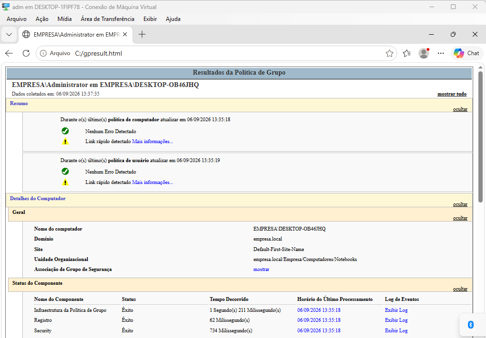

## File Server

Também foi configurado um compartilhamento de arquivos para simular um recurso utilizado pelos departamentos da empresa.

Um exemplo de compartilhamento utilizado no laboratório:

```text
\\SERVIDORWIN\TI
```

As permissões foram trabalhadas utilizando grupos do Active Directory e permissões NTFS.

Isso permite controlar quais usuários podem acessar, modificar ou apenas visualizar determinados arquivos e pastas.

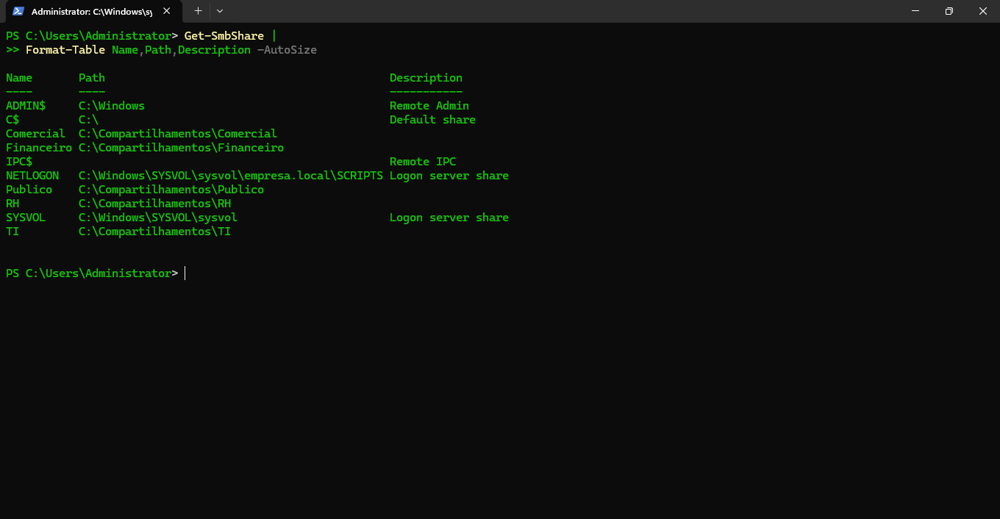

## PowerShell

Durante o laboratório, utilizei PowerShell para consultar informações e realizar tarefas administrativas no Active Directory.

Alguns comandos utilizados:

```powershell
Get-ADUser -Filter *
```

```powershell
Get-ADGroup -Filter *
```

```powershell
Get-ADComputer -Filter *
```

```powershell
Get-ADDomain
```

```powershell
Get-ADDomainController
```

```powershell
Get-ADOrganizationalUnit -Filter *
```

Também foram criados scripts para facilitar consultas e diagnósticos.

Os scripts estão disponíveis na pasta:

```text
scripts/
```

### Scripts disponíveis

```text
scripts/
│
├── consulta-usuarios.ps1
├── consulta-grupos.ps1
├── consulta-computadores.ps1
├── consulta-dominio.ps1
├── troubleshooting-usuario.ps1
└── diagnostico-rede.ps1
```

## Troubleshooting

Além da configuração dos serviços, o laboratório foi utilizado para simular situações que podem acontecer em um ambiente de suporte técnico.

### Exemplo: problema com conta de usuário

```text
Usuário não consegue acessar
          ↓
Verificar conta no Active Directory
          ↓
Verificar se a conta está habilitada
          ↓
Verificar se está bloqueada
          ↓
Verificar grupos e permissões
          ↓
Testar autenticação
```

### Exemplo: cliente não encontra o servidor

```text
Cliente não consegue acessar o servidor
          ↓
Verificar configuração de IP
          ↓
Testar conectividade
          ↓
Verificar DNS
          ↓
Testar comunicação com SERVIDORWIN
```

Esses testes foram importantes para praticar não apenas a configuração do ambiente, mas também a identificação e resolução de problemas.

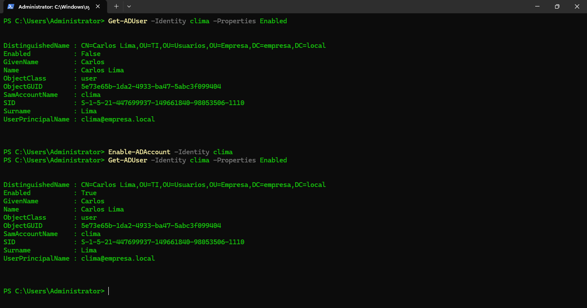

## Evidências

As principais etapas do laboratório foram registradas através de prints.

As imagens estão disponíveis na pasta:

```text
imagens/
```

Entre as evidências estão:

* Configuração do servidor
* Domínio
* Domain Controller
* Estrutura das OUs
* Usuários
* Grupos
* Computadores
* Ingresso no domínio
* Conectividade
* DNS
* DHCP
* GPO
* File Server
* Troubleshooting

## Resultado

Ao final do projeto, consegui montar um ambiente Windows Server com Active Directory e uma máquina cliente integrada ao domínio.

Durante a prática, trabalhei com gerenciamento de usuários e grupos, organização de OUs, computadores, DNS, DHCP, GPO, compartilhamento de arquivos, permissões e PowerShell.

O laboratório também foi utilizado para simular situações de troubleshooting que podem aparecer no dia a dia de um profissional de Suporte Técnico ou Infraestrutura de TI.

## Competências praticadas

* Administração do Windows Server
* Active Directory
* Gerenciamento de usuários e grupos
* Organização de OUs
* Gerenciamento de computadores
* DNS
* DHCP
* Group Policy
* File Server
* Permissões NTFS
* SMB
* PowerShell
* Troubleshooting de rede
* Troubleshooting de contas de usuário
* Virtualização com Microsoft Hyper-V

## Autor

**Renato Oliveira Fonseca**

Projeto desenvolvido para fins de estudo e prática profissional em **Suporte Técnico e Infraestrutura de TI**.
